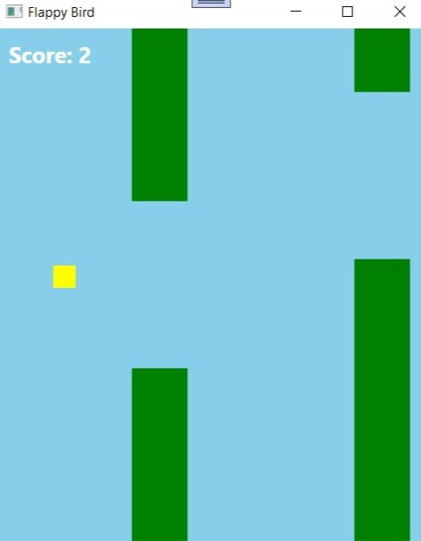

# Flappy Bird Game

A simple 2D Flappy Bird clone built with WPF (Windows Presentation Foundation) in C#.

 

## Description

Flappy Bird is a classic 2D game where the player controls a bird navigating through pipes. The objective is to pass between the pipes without colliding with them or hitting the ground, while earning points for each successful pass.

## Features

- **Bird Movement**: The bird falls due to gravity and can be made to jump by pressing the Space key
- **Obstacles**: Pipes move from right to left at consistent intervals with gaps for the bird to pass through
- **Scoring System**: Each successful pass through a pipe pair earns one point
- **Game Over Detection**: The game ends when the bird hits a pipe or the ground
- **Restart Functionality**: Press 'R' to restart the game at any time

## How to Play

1. **Start the Game**: The bird begins falling automatically when the game starts
2. **Control the Bird**: Press the Space key to make the bird jump/flap
3. **Avoid Obstacles**: Navigate through the gaps between the pipes
4. **Score Points**: Each successful pass through a pipe pair increases your score
5. **Game Over**: When you hit a pipe or the ground, the game ends
6. **Restart**: Press 'R' to start a new game

## Technical Details

- Built with WPF (Windows Presentation Foundation)
- Uses C# and XAML
- .NET Framework 4.8
- DispatcherTimer for game loop
- Canvas for rendering game elements

## Installation

1. Clone the repository
2. Open the solution in Visual Studio
3. Build and run the project

## Future Improvements

- Add difficulty levels
- Implement high score system
- Add sound effects
- Improve graphics with sprites
- Add start screen and pause functionality

## License

This project is open source and available under the [MIT License](LICENSE).
